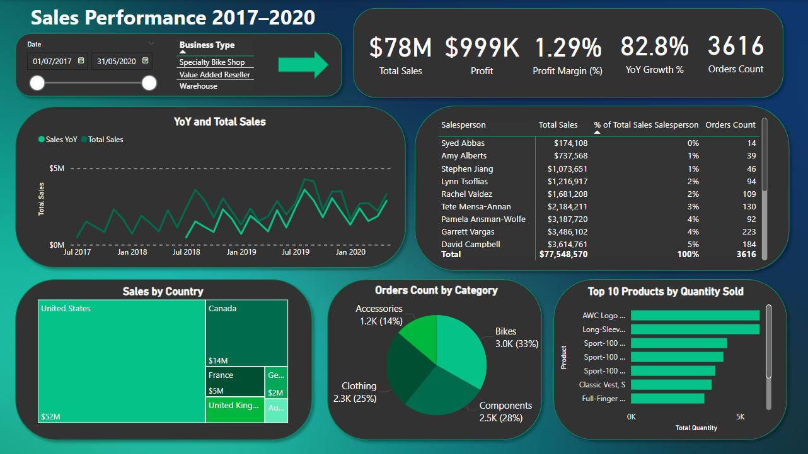
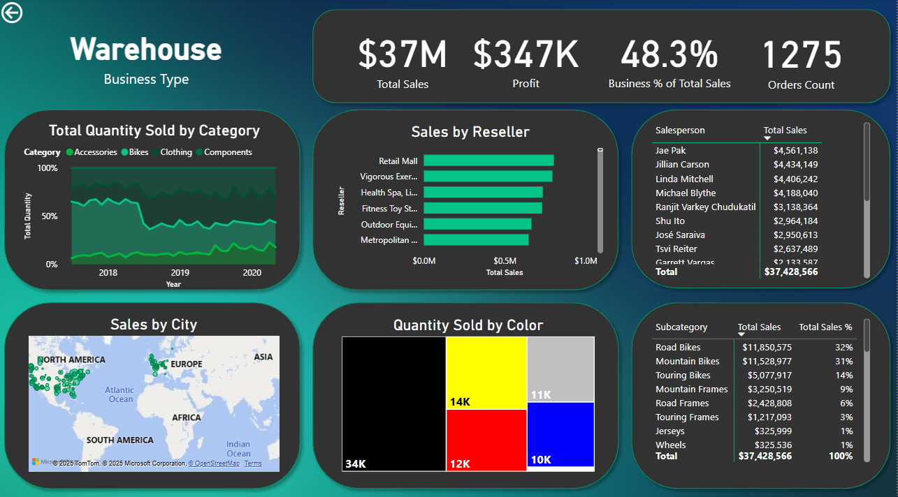

# 🚴‍♂️ Sales Performance Dashboard (2017–2020) — Adventure Works

## 📊 Overview

This project showcases an interactive **Power BI dashboard** created using the **Adventure Works** dataset (2017–2020). The report delivers business insights into sales, profits, and product performance while demonstrating my skills in **data modeling**, **DAX**, and **interactive dashboard design**.



---

## 💼 Key Business Questions Addressed

* What are the total sales, profit, and order volume trends over time?
* Which salespeople, countries, and products generate the most value?
* How are different **business types** performing?
* What are the top-selling product categories?
* How are orders distributed by region, category, and reseller?

---

## 🧠 Key Features & Measures

### 🧮 Custom DAX Measures

* **Total Sales**
  `Total Sales = SUM(Sales[SalesAmount])`

* **Profit**
  `Profit = SUM(Sales[Profit])`

* **Profit Margin %**
  `Profit Margin = DIVIDE([Profit], [Total Sales])`

* **YoY Growth %**
  `YoY Growth % = DIVIDE([Total Sales] - [Sales LY], [Sales LY])`

* **Orders Count**
  `Orders Count = DISTINCTCOUNT(Sales[OrderNumber])`

* **Sales % by Salesperson**
  `Sales % = DIVIDE([Salesperson Sales], [Total Sales])`

---

## 📊 Report Pages

### 🔹 Main Dashboard

An executive summary view showing:

* KPIs: Total Sales, Profit, Profit Margin, YoY Growth %, Orders Count
* YoY & Total Sales trends (Line Chart)
* Sales by Country (Treemap)
* Orders by Product Category (Donut)
* Top 10 Products by Quantity Sold
* Sales by Salesperson (Matrix)
* Slicer: Business Type (with drillthrough support)


---

### 🔸 Drillthrough: Business Type Details

Drillthrough enabled for:

* **Warehouse**
* **Specialty Bike Shop**
* **Value Added Reseller**

Each drillthrough page provides a **consistent set of visuals** for a selected **Business Type**, allowing stakeholders to analyze performance in a specific segment.

#### 🔍 Drillthrough Visuals (Same for all Business Types):

* **Total Quantity Sold by Category** (Area Chart)
* **Sales by Reseller** (Bar Chart)
* **Sales by City** (Map)
* **Quantity Sold by Color** (Treemap)
* **Sales by Subcategory** (Table with % of Total Sales)
* **Top Salespeople by Business Type** (Table)

> 📌 These pages are filtered dynamically based on the business type selected on the main dashboard.



---

## 🧩 Data Model & Transformation

* Cleaned and prepared in **Power Query**
* Star schema with fact and dimension tables:

  * Sales, Products, Time, Resellers, Geography, Business Type
* Relationships configured for accurate cross-filtering

---

## 🎯 Project Goals

This dashboard is part of my **Data Analytics Portfolio**, aimed at demonstrating:

* Business understanding and metric design
* Power BI interactivity & visual storytelling
* DAX skills for KPIs and dynamic calculations
* Drillthrough implementation and report design

---

## 🛠️ Tools & Technologies Used

* Power BI Desktop
* Power Query
* DAX
* Adventure Works dataset (CSV format)

---

## 📁 Repository Structure

```
📁 AdventureWorks-SalesDashboard
│
├── 📊 Dashboard.pbix
├── 📄 README.md
└── 📷 screenshots
    ├── sales-performance-main.png
    └── drillthrough-template.png
```


